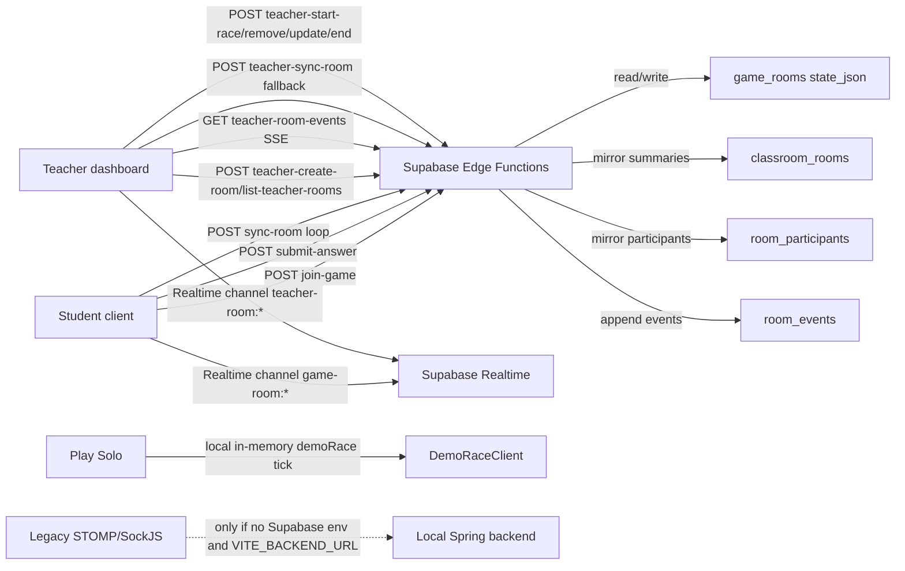
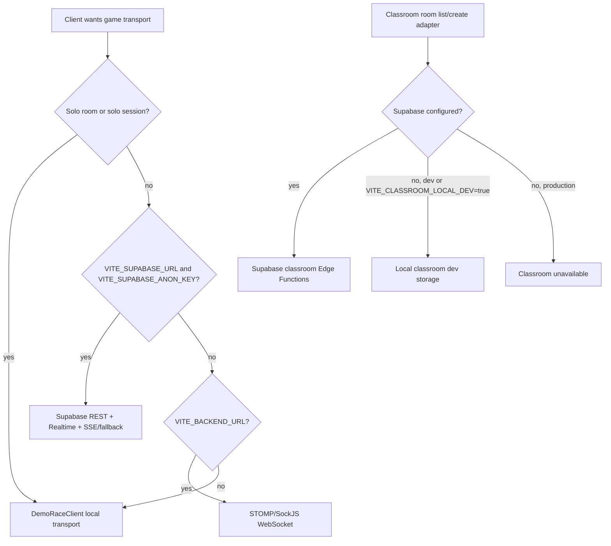
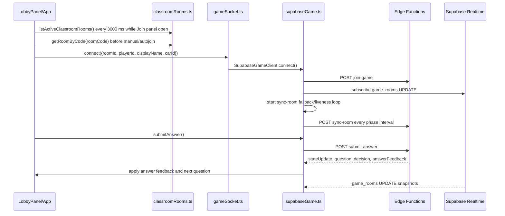
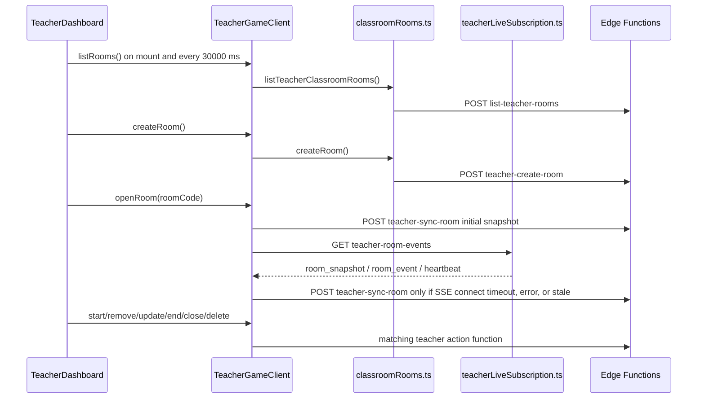
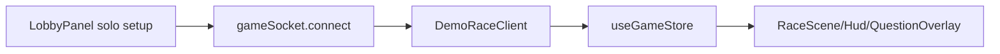

# Communication Audit

Date: 2026-05-27

Scope: read-only architecture and debugging audit of the game communication layer. No gameplay, UI, scoring, lifecycle, migration, transport, polling, or SSE behavior was changed.

## Executive Summary

The current app is not using one communication model. It uses:

- Supabase Edge Function REST calls for authoritative classroom actions.
- Supabase Realtime `postgres_changes` channels on `game_rooms` for coarse state updates.
- A teacher SSE stream implemented by the `teacher-room-events` Edge Function.
- Client-side fallback polling for student room sync and teacher room sync.
- A local demo transport for Play Solo and local classroom development.
- A legacy/local Spring STOMP-over-SockJS WebSocket transport that is present but normally bypassed in Supabase mode.

The repeated network entries seen in Chrome DevTools are expected from the current implementation:

- `list-active-classroom-rooms` repeats every 3000 ms while the Join Room panel is open.
- `sync-room` repeats after student join as a liveness/fallback sync loop: every 2000 ms while racing, every 1000 ms while starting, every 5000 ms in other foreground phases, every 10000 ms while the tab is hidden.
- `teacher-sync-room` appears on initial teacher room open and as fallback polling when the teacher SSE stream is not connected, times out, errors, or is considered stale. When SSE is healthy, there is a guard that blocks teacher polling.

WebSocket support exists, but in the current Vite/Supabase mode it is not the active classroom transport. The transport selector prefers Supabase whenever `VITE_SUPABASE_URL` and `VITE_SUPABASE_ANON_KEY` are configured.

## Current Architecture Diagram

## Transport Decision Tree

Evidence:

- `client/src/game/network/transportConfig.ts:12-50` chooses Supabase first, WebSocket second, demo last.
- `client/src/game/network/gameSocket.ts:456-467` forces Solo to demo and otherwise delegates to `getConfiguredGameTransport()`.
- `client/src/game/network/classroomRooms.ts:150-170` chooses the classroom service as Supabase if Supabase config exists, otherwise local dev in dev mode.

## Student Flow

## Teacher Flow

## Solo Flow

Solo should be local only. In the current client, Solo is forced to demo transport by `gameSocket.ts:456-467`. `demoRace.ts` uses in-memory timers and intervals, not browser network.

## Network Call Inventory

| Endpoint / transport | Called from | Caller | Audience | Trigger | Frequency | Cleanup | Payload shape | Response shape | Correctness role | Replaceable by Realtime/WebSocket? | Risk |
|---|---|---|---|---|---|---|---|---|---|---|---|
| `list-active-classroom-rooms` | `client/src/game/network/classroomRooms.ts:331-334`, started by `client/src/components/LobbyPanel.tsx:157-180` | Join Room panel | Student | Join panel opens; refresh button | Immediate, then every 3000 ms while `joinBoxOpen` | `clearInterval` on panel close/unmount | none | `{ rooms }` | UI discovery only | Yes. Realtime on `classroom_rooms` or manual refresh | Low |
| `get-classroom-room` | `classroomRooms.ts:336-338`; `LobbyPanel.tsx:262`; `App.tsx:96-129` | Join validation/autojoin | Student/shared | Manual join/autojoin | One-time | Promise only | `{ roomCode }` | `{ room }` | Correctness guard before joining | Keep REST or replace bootstrap with Realtime lookup | Low |
| `join-game` | `supabaseGame.ts:119-122` | `gameSocket.connect` -> SupabaseGameClient | Student | After join form/autojoin | One-time per connection | No abort on join; failure sets error | `{ roomId, playerId, displayName, carId, sessionId }` | `{ joined, stateUpdate, question?, decision? }` | Required authoritative join/resume | Keep REST for authoritative write | High |
| `sync-room` | `supabaseGame.ts:266-441` | SupabaseGameClient | Student | After successful join | 1000 ms starting, 2000 ms active, 5000 ms other foreground, 10000 ms hidden, with backoff to 15000 ms | `clearTimeout`, `AbortController.abort`, visibility listener cleanup | `{ roomId, playerId, sessionId }` | `{ stateUpdate, question?, decision?, error? }` | Liveness, presence, fallback state, teacher start/end/remove/map updates | Yes, mostly. Presence still needs a heartbeat or Realtime presence | Medium/high |
| `submit-answer` | `supabaseGame.ts:157-177` | QuestionOverlay via gameSocket | Student | Answer click or timeout | Per question answer | No AbortController; duplicate prevention in store/UI | `{ roomId, playerId, sessionId, questionId, answer, timeout }` | `{ stateUpdate, answerFeedback, question?, decision? }` | Required authoritative validation | Keep REST or move to authoritative WebSocket only | High |
| `submit-decision` | `supabaseGame.ts:179-197` | Route choice | Student | Route choice selection | Per route choice | No AbortController | `{ roomId, playerId, sessionId, eventId, choice }` | `{ stateUpdate, question?, decision? }` | Required route decision | Keep REST or authoritative WebSocket | Medium/high |
| `start-race` | `supabaseGame.ts:199-212` | Student/client room creator path | Shared/legacy | Start button in non-teacher flow | One-time | No abort | `{ roomId, playerId, sessionId }` | `{ stateUpdate }` | Legacy/shared action | Could be removed or Realtime-triggered after REST | Medium |
| `update-room-settings` | `supabaseGame.ts:214-231` | Student/client room creator path | Shared/legacy | Settings update | User action | No abort | `{ roomId, playerId, sessionId, roomSettings }` | `{ stateUpdate }` | Legacy/shared action | Could be REST-only teacher path | Medium |
| `set-ready` | `supabaseGame.ts:233-249` and function exists | Shared/legacy | Legacy only | Ready action | User action | No abort | `{ roomId, playerId, sessionId, ready }` | `{ stateUpdate }` | Should not be used for current classroom rules | Can be removed later | Medium |
| `return-to-lobby` | `supabaseGame.ts:251-264` | Student/client room creator path | Shared/legacy | Return action | User action | No abort | session payload | `{ stateUpdate }` | Legacy/shared action | REST or teacher-only action | Medium |
| `leave-game` | `supabaseGame.ts:138-155` | SupabaseGameClient.disconnect | Student | Leave/unload/disconnect | One-time best effort | Called after sync stop/channel removal | session payload | usually `{ stateUpdate? }` | Presence/disconnect marker | Realtime presence or REST | Medium |
| `game_rooms` Realtime channel | `supabaseGame.ts:343-365` | SupabaseGameClient | Student | After join | Push updates | `removeChannel` on disconnect | DB UPDATE payload | `state_json` converted to stateUpdate | Fallback/update path | Already Realtime, but on old aggregate table | Medium |
| `teacher-create-room` | `classroomRooms.ts:307-323`; `teacherGameClient.ts:255-284` | Teacher create form | Teacher | Create Room button | One-time | Promise only | `{ roomId, teacherSessionId, roomSettings, className, difficulty, mapId, questionTypes:["MIXED"], requiresApproval:false }` | `{ stateUpdate }` plus follow-up `get-classroom-room` | Required authoritative create | Keep REST | High |
| `list-teacher-rooms` | `classroomRooms.ts:325-328`; `TeacherDashboard.tsx:58-78` | TeacherDashboard | Teacher | Dashboard mount; after create/start/end; rooms drawer actions | Immediate, every 30000 ms | `clearInterval` on unmount | `{ teacherSessionId }` | `{ rooms }` | UI room list | Yes. Realtime on `classroom_rooms` by teacher | Low/medium |
| `teacher-sync-room` initial | `teacherGameClient.ts:228-253` | TeacherGameClient.openRoom | Teacher | Selecting/opening a room | One-time per room open | Promise only | `{ roomCode, teacherSessionId }` | `{ stateUpdate }` | Initial dashboard snapshot | Keep REST bootstrap | Low |
| `teacher-sync-room` fallback | `teacherGameClient.ts:541-635` | TeacherGameClient fallback loop | Teacher | SSE connect timeout, SSE error, SSE stale | 5000 ms waiting/racing, 15000 ms hidden/other, backoff to 30000 ms after failures | `clearTimeout`, `AbortController.abort`, generation guard | `{ roomCode, teacherSessionId }` | `{ stateUpdate }` | Fallback dashboard state | Yes, if Realtime/SSE reliable | Medium |
| `teacher-room-events` SSE | `teacherGameClient.ts:655-704`; `teacherLiveSubscription.ts:86-163`; server `teacher-room-events/index.ts:55-183` | Teacher live dashboard | Teacher | Create/open room | One long GET stream | Client aborts on disconnect; server clears interval on cancel | query: `roomCode`, `teacherSessionId` | SSE `room_snapshot`, `room_event`, `heartbeat`, terminal events | Main live teacher transport | Replace with Supabase Realtime on rooms/events/participants | Medium |
| `game_rooms` teacher Realtime channel | `teacherGameClient.ts:519-539` | TeacherGameClient | Teacher | Intended subscription helper | Push updates | `removeChannel` in `clearRuntime` | DB UPDATE payload | `state_json` converted to stateUpdate | Currently defined, but `startSupabaseLive()` does not call it in the inspected path | Could be used instead of SSE/fallback | Medium |
| `teacher-update-room-settings` | `teacherGameClient.ts:287-305` | Teacher settings | Teacher | Settings/map update | User action | No abort | `{ roomCode, teacherSessionId, roomSettings }` | `{ stateUpdate? }` | Required teacher action | Keep REST write; Realtime for propagation | Medium |
| `teacher-remove-player` | `teacherGameClient.ts:307-329` | Teacher dashboard | Teacher | Remove click | User action | No abort | `{ roomCode, teacherSessionId, targetPlayerId }` | `{ stateUpdate? }` | Required teacher action | Keep REST write; Realtime for propagation | Medium |
| `teacher-start-race` | `teacherGameClient.ts:332-343` | Teacher dashboard | Teacher | Start Race button | User action | No abort | `{ roomCode, teacherSessionId }` | `{ stateUpdate? }` | Required teacher action | Keep REST write; Realtime for propagation | High |
| `teacher-close-room` | `classroomRooms.ts:357-359`; `teacherGameClient.ts:356-369` | Teacher dashboard | Teacher | Close Room | User action | Promise only | `{ roomCode, teacherSessionId }` | `{ stateUpdate? }` | Required lifecycle action | Keep REST write | Medium |
| `teacher-end-room` | `classroomRooms.ts:361-363`; `teacherGameClient.ts:345-354` | Teacher dashboard | Teacher | End/Return to lobby path | User action | Promise only | `{ roomCode, teacherSessionId }` | `{ stateUpdate? }` | Required lifecycle action | Keep REST write | Medium |
| `teacher-delete-room` | `classroomRooms.ts:353-355`; `teacherGameClient.ts:371-382` | Teacher rooms drawer | Teacher | Delete room | User action | Promise only | `{ roomCode, teacherSessionId }` | `{ stateUpdate? }` | Required archive/delete | Keep REST write | Medium |
| `teacher-archive-stale-classroom-rooms` | `classroomRooms.ts:341-351`; `TeacherDashboard.tsx:330-350` | Dev diagnostics button | Teacher/dev | Button click | One-time | Promise only | `{ teacherSessionId, thresholdHours, excludeRoomCode }` | `{ archivedCount, thresholdHours }` | Maintenance only | REST fine | Low |
| STOMP/SockJS `/ws` | `gameSocket.ts:401-453` | GameSocketClient | Shared legacy | Only if no Supabase env and `VITE_BACKEND_URL` exists | Long-lived socket plus reconnect | `client.deactivate`, unsubscribe | join/sync/answer/start/etc STOMP messages | personal queues: state, joined, question, decision, feedback, error | Legacy/local backend | Full WebSocket option, but not current Supabase classroom | High |
| WebSocket `/app/game.sync` | `gameSocket.ts:530-562` | GameSocketClient | Legacy WebSocket | After WebSocket join | Every 250 ms | `clearInterval` | `{ roomId, playerId }` | queue state updates | Legacy sync loop | Not used in Supabase mode | High |
| DemoRaceClient local timers | `demoRace.ts:386-463`, `640-666`, `850-864` | DemoRaceClient | Solo/local dev | Demo/local connect/start | `TICK_MS` interval | `clearTimeout`, `clearInterval`, local unsubscribe | in-memory only | store updates | Local simulation | Not network | Low |

## Why `list-active-classroom-rooms` Repeats

Root cause: `LobbyPanel` starts a fixed 3000 ms interval whenever `joinBoxOpen` is true.

Evidence:

- `client/src/components/LobbyPanel.tsx:157-167` defines `refreshActiveClassrooms()` and calls `listActiveClassroomRooms()`.
- `client/src/components/LobbyPanel.tsx:169-180` starts immediate refresh and `window.setInterval(..., 3000)` while the Join Room panel is open.
- `client/src/game/network/classroomRooms.ts:331-334` maps that to the Supabase function `list-active-classroom-rooms`.
- `client/src/components/LobbyPanel.tsx:690-705` also has a manual refresh button that invokes the same refresh.

Answers to specific questions:

- It is tied to the Join Room panel being open.
- It does not appear to start merely because `LobbyPanel` mounts while closed.
- It uses `setInterval`, not timeout backoff or focus refresh.
- It should stop when the Join Room panel closes or the component unmounts because cleanup clears the interval.
- It can run in multiple browser tabs independently.
- It should not run while teacher dashboard is rendered because `App.tsx:146-150` hides `LobbyPanel` when `teacher=1`.
- It can be reduced to manual refresh, refresh-on-open, longer 30-60 second polling while open, or Realtime room list updates.

## Why `sync-room` Repeats

Root cause: after a successful Supabase classroom join, `SupabaseGameClient` subscribes to Realtime and also starts a persistent `sync-room` fallback/liveness loop.

Evidence:

- `client/src/game/network/supabaseGame.ts:119-129` calls `join-game`, applies the response, subscribes to room changes, then starts the sync loop.
- `client/src/game/network/supabaseGame.ts:266-285` starts the lifecycle, visibility listener, and first timeout.
- `client/src/game/network/supabaseGame.ts:325-337` sets intervals by phase: hidden 10000 ms, active 2000 ms, starting 1000 ms, otherwise 5000 ms.
- `client/src/game/network/supabaseGame.ts:376-441` invokes `sync-room`, records diagnostics, applies response, backs off failures, and schedules the next timeout.
- `client/src/game/network/supabaseGame.ts:343-365` also subscribes to `game_rooms` Realtime, so `sync-room` is partly duplicative.

Current reasons it still exists:

- Student presence/liveness relies on repeated `sync-room` calls with `{ roomId, playerId, sessionId }`.
- It is the fallback path for teacher start/end/remove/map changes if Realtime is late or unavailable.
- It can return current `question` and `decision` in addition to state snapshots.
- It handles terminal room states and teacher removal.

Stop behavior:

- `disconnect()` stops the loop, removes the Realtime channel, and best-effort calls `leave-game` (`supabaseGame.ts:138-155`).
- `stopSyncLoop()` clears timeout, aborts in-flight fetch, removes visibility listener, and resets lifecycle state (`supabaseGame.ts:288-308`).
- Terminal lifecycle or missing local participant stops the loop (`supabaseGame.ts:400-408`).
- Repeated failures stop after five failed syncs (`supabaseGame.ts:410-419`).

Replacement feasibility:

- Realtime can replace most state refresh and room update needs.
- A lightweight heartbeat is still needed unless Supabase Realtime presence is used or presence is moved to participant heartbeat updates.
- `submit-answer` should remain authoritative REST unless moving to an authoritative WebSocket server.

## Why `teacher-sync-room` Repeats

Root cause: teacher live mode uses `teacher-room-events` SSE as the primary stream, but starts `teacher-sync-room` fallback polling when SSE does not connect within the timeout, errors, or becomes stale.

Evidence:

- `client/src/components/teacher/teacherGameClient.ts:228-253` calls `teacher-sync-room` once to open a selected room and get the initial snapshot.
- `client/src/components/teacher/teacherGameClient.ts:655-704` starts the SSE stream.
- `client/src/components/teacher/teacherGameClient.ts:661-667` starts fallback polling if SSE connect timeout fires.
- `client/src/components/teacher/teacherGameClient.ts:693-703` starts fallback polling on SSE error.
- `client/src/components/teacher/teacherGameClient.ts:776-792` starts fallback polling if SSE is stale.
- `client/src/components/teacher/teacherGameClient.ts:541-635` runs fallback polling with 5000 ms foreground waiting/racing intervals, 15000 ms hidden/other, and failure backoff.
- `client/src/components/teacher/teacherGameClient.ts:743-763` blocks `teacher-sync-room` when SSE is connected or recently healthy, records `teacher-sync-room-blocked`, and stops any active fallback sync.

SSE implementation details:

- The client opens `GET /functions/v1/teacher-room-events?roomCode=...&teacherSessionId=...` in `teacherLiveSubscription.ts:86-98`.
- The client reads the fetch stream via `response.body.getReader()` in `teacherLiveSubscription.ts:108-145`.
- The server sends a snapshot immediately, then every 1000 ms internally (`supabase/functions/teacher-room-events/index.ts:99-164`).
- The server stream emits heartbeats every 15000 ms and closes on terminal room states (`teacher-room-events/index.ts:141-151`).
- Cleanup aborts the fetch stream client-side and clears the server interval on stream cancel (`teacherLiveSubscription.ts:155-163`; `teacher-room-events/index.ts:166-172`).

If `teacher-sync-room` appears while SSE is healthy, likely causes are:

- The initial `openRoom()` snapshot call before SSE is started.
- A fallback request started during SSE connect timeout before the first SSE snapshot arrives.
- SSE stale/error state.
- A selected-room switch before cleanup completes.
- A bug where `liveTransportState`, `sseConnected`, or `lastSseEventAtMs` is not updated quickly enough for `blockTeacherSyncRoomRequest()`.

The inspected code already contains a guard intended to prevent teacher polling while SSE is healthy.

## WebSocket Support Audit

WebSocket is currently implemented in `client/src/game/network/gameSocket.ts` using STOMP over SockJS:

- `gameSocket.ts:401-407` creates a SockJS URL from `VITE_BACKEND_URL`.
- `gameSocket.ts:405-453` creates and activates the STOMP client.
- `gameSocket.ts:302-366` subscribes to personal queues:
  - `/user/queue/game.state`
  - `/user/queue/game.joined`
  - `/user/queue/game.question`
  - `/user/queue/game.decision`
  - `/user/queue/game.answer-feedback`
  - `/user/queue/game.error`
- `gameSocket.ts:423-432` publishes `/app/game.join`.
- `gameSocket.ts:256-280` publishes `/app/game.returnToLobby`.
- `gameSocket.ts:484-498` publishes `/app/game.leave`.
- `gameSocket.ts:530-562` publishes `/app/game.sync` every 250 ms after WebSocket join.

Whether it is used now:

- If `VITE_SUPABASE_URL` and `VITE_SUPABASE_ANON_KEY` are configured, WebSocket is not used.
- If Supabase is not configured but `VITE_BACKEND_URL` is configured, WebSocket is used for non-Solo sessions.
- Solo is forced to demo/local regardless of backend config.

Current WebSocket likely does not cover the new Supabase classroom room list and teacher dashboard architecture. The current classroom teacher flows use Supabase functions and `classroom_rooms`/`room_participants`/`room_events`, while WebSocket code speaks older game queue messages and `/app/game.*` destinations.

## Supabase Realtime Feasibility

| Table | Current role | Updated often enough? | Normalized enough? | Payload enough? | RLS/policies needed? | Replica identity full? | Could replace |
|---|---|---:|---:|---:|---:|---:|---|
| `game_rooms` | Aggregate authoritative state JSON used by room-store and existing Realtime channels | Yes, every room mutation | No, aggregate `state_json` blob | Yes for full state, but heavy | Yes, especially direct client subscriptions | Useful if clients need old values/deletes; update payload has new row | Student `sync-room` state refresh; teacher snapshots |
| `classroom_rooms` | Room list/search summary mirror | Yes for create/start/end/close/settings/player count | Yes for room list | Yes for active rooms list and teacher room list | Yes, public list policies or service mediated channel needed | Helpful for deletes/status changes | `list-active-classroom-rooms`, `list-teacher-rooms` polling |
| `room_participants` | Per-participant score/status/progress mirror | Yes after joins, answers, disconnects | Yes | Yes for teacher dashboard rows and participant changes | Yes, restrict by room/teacher/student session | Helpful for status transitions | `teacher-sync-room` dashboard rows; parts of `sync-room` |
| `room_events` | Append-only teacher event feed | Yes for meaningful events | Yes | Yes for teacher activity feed | Yes, room-scoped access needed | Not usually needed for insert-only feed | `teacher-room-events` SSE room_event portion |
| `race_results` | Finished race results | Only at finish | Yes | Yes for result history | Yes | Not necessary | Results refresh/history |
| `game_room_presence` | Legacy presence/liveness | Yes if heartbeat remains | Mostly | Yes for session last seen | Yes | Useful for presence deletes | Student heartbeat/disconnect detection |

Notes:

- The project currently subscribes to Supabase Realtime on `game_rooms`, not directly to `classroom_rooms`, `room_participants`, or `room_events`.
- The classroom mirror tables are better shaped for Realtime than `game_rooms.state_json`, especially for room lists and teacher dashboard rows.
- To use Realtime safely in production, table publication and RLS policies must be explicit. The migrations enable RLS, but the inspected migrations do not show publication or Realtime policy setup.
- `room_events` can replace the custom SSE event stream if teacher clients subscribe to inserts for the selected room.
- `submit-answer` should remain REST because server-authoritative validation and duplicate protection are important.

## Conflicting or Duplicate Sources

| Data | Current sources | Conflict/duplication |
|---|---|---|
| Student room state | `join-game`, `sync-room`, `game_rooms` Realtime, `submit-answer` response | Sync and Realtime can duplicate newer answer response data. The store now has question stale guards, but the transport architecture still sends multiple snapshots. |
| Current question | `join-game`, `sync-room`, `submit-answer`, Realtime state | Submit-answer is the fastest authoritative next-question response. Later snapshots can still carry question fields, so stale guards matter. |
| Teacher dashboard state | Initial `teacher-sync-room`, SSE snapshots, fallback `teacher-sync-room`, possible `game_rooms` Realtime helper | Multiple teacher paths exist; inspected live path primarily uses SSE plus fallback polling. |
| Active classroom room list | `list-active-classroom-rooms` interval, `get-classroom-room` join lookup | Room list polling is UI refresh only; join lookup is correctness guard. |
| Presence | `sync-room` liveness, `leave-game`, `game_room_presence`, participant mirror fields | Realtime update alone does not replace heartbeat unless presence is redesigned. |

## Existing Diagnostics

There is already a development diagnostics system:

- `client/src/game/sync/syncLifecycle.ts:23-29` tracks `sync-room`, `teacher-sync-room`, `teacher-sync-room-blocked`, `teacher-room-events`, and `list-teacher-rooms`.
- `client/src/game/sync/syncLifecycle.ts:129-142` exposes active lifecycle entries, active timer count, and request counts over the last 60 seconds.
- `client/src/components/teacher/TeacherDashboard.tsx:382-428` renders teacher diagnostics in development.
- `client/src/components/LobbyPanel.tsx:816-825` renders student sync diagnostics in development.

Gap: `list-active-classroom-rooms` is not currently included in `NetworkRequestName`, so DevTools is still needed to count active-room-list requests unless diagnostics are extended later.

No diagnostics code was added in this audit.

## Migration Options

### Option A: Minimal Cleanup

Keep REST/SSE. Reduce unnecessary polling.

Files likely affected:

- `client/src/components/LobbyPanel.tsx`
- `client/src/game/network/supabaseGame.ts`
- `client/src/components/teacher/teacherGameClient.ts`
- `client/src/game/sync/syncLifecycle.ts`

Expected request reduction:

- `list-active-classroom-rooms`: from every 3 seconds to manual/open-only or every 30-60 seconds.
- `sync-room`: can be reduced in waiting/lobby states, but likely remains as heartbeat.
- `teacher-sync-room`: already guarded; tighten stale/connect timeout behavior if needed.

Risks:

- Student may miss teacher start/end/remove if Realtime is unreliable and polling is too slow.
- Disconnect detection may become slower.

Recommended steps:

1. Change active room list to refresh on panel open, manual refresh, and optional 30-60 second interval only while open.
2. Keep `submit-answer` REST unchanged.
3. Keep student `sync-room` but reduce waiting/racing frequency after verifying Realtime health.
4. Add diagnostics for `list-active-classroom-rooms` counts before and after.

Risk level: low.

### Option B: Hybrid Supabase Realtime

Use Realtime for room list and room participant updates. Keep REST for authoritative writes.

Files likely affected:

- `client/src/game/network/classroomRooms.ts`
- `client/src/game/network/supabaseGame.ts`
- `client/src/components/teacher/teacherGameClient.ts`
- `client/src/game/sync/teacherLiveSubscription.ts`
- Supabase migrations/policies/publication setup

Expected request reduction:

- Replace most `list-active-classroom-rooms` polling.
- Replace most `teacher-sync-room` fallback needs.
- Reduce `sync-room` to heartbeat or rare reconciliation.
- Potentially replace `teacher-room-events` SSE with `room_events` inserts and `room_participants` updates.

Risks:

- Requires correct Supabase Realtime publication and RLS policies.
- Need careful privacy: classroom rooms and participants should not leak broadly.
- Need robust reconnect/resubscribe logic.
- Browser tabs and local session identity must remain correct.

Recommended steps:

1. Enable and verify Realtime for `classroom_rooms`, `room_participants`, and `room_events`.
2. Subscribe to `classroom_rooms` for active list while Join panel is open.
3. Subscribe teacher dashboard to selected room participant and event rows.
4. Keep `submit-answer`, join, start, remove, end, create as REST.
5. Reduce `sync-room` to heartbeat/reconciliation only after proving Realtime coverage.

Risk level: medium.

### Option C: Full WebSocket Authoritative Server

Move all game events through one authoritative WebSocket service.

Files likely affected:

- `client/src/game/network/gameSocket.ts`
- `client/src/game/network/supabaseGame.ts`
- All Supabase Edge Function classroom equivalents or a new backend service
- Teacher dashboard client code
- Backend server implementation

Expected request reduction:

- Browser Network would show one socket per active student/teacher plus optional bootstrap REST.
- Removes most polling/SSE noise.

Risks:

- Highest backend ownership cost.
- Current WebSocket path appears tied to older `/app/game.*` protocol, not the current classroom tables/events/question engine flow.
- Requires new authoritative validation, participant resume, teacher dashboard, room list, and deployment story.
- Easy to regress recent classroom fixes.

Risk level: high.

## Recommendation

Recommended next step: Option A first, then Option B.

Option A directly addresses the observed network noise with low risk. Option B is the best medium-term architecture for this project because Supabase is already the authoritative classroom backend and the data is already mirrored into normalized classroom tables. A full custom WebSocket backend is not the best immediate migration path unless the project intentionally wants to own a separate always-on authoritative game server.

## Files Inspected

Client:

- `client/src/App.tsx`
- `client/src/components/LobbyPanel.tsx`
- `client/src/components/QuestionOverlay.tsx`
- `client/src/components/teacher/TeacherDashboard.tsx`
- `client/src/components/teacher/teacherGameClient.ts`
- `client/src/game/network/classroomRooms.ts`
- `client/src/game/network/demoRace.ts`
- `client/src/game/network/gameSocket.ts`
- `client/src/game/network/supabaseGame.ts`
- `client/src/game/network/transportConfig.ts`
- `client/src/game/store/useGameStore.ts`
- `client/src/game/sync/syncLifecycle.ts`
- `client/src/game/sync/teacherLiveSubscription.ts`

Supabase:

- `supabase/functions/*/index.ts`
- `supabase/functions/_shared/classroom-store.ts`
- `supabase/functions/_shared/room-store.ts`
- `supabase/functions/_shared/game-core.ts`
- `supabase/functions/_shared/contracts.ts`
- `supabase/functions/_shared/teacher-room-identity.ts`
- `supabase/migrations/20260406_create_game_backend.sql`
- `supabase/migrations/20260427_create_game_room_presence.sql`
- `supabase/migrations/202605250001_classroom_room_lifecycle.sql`
- `supabase/migrations/202605270001_question_engine_participant_stats.sql`

## Build/Test Status

- `npm run build` from `client/`: passed.
- Relevant tests: no test script is defined in `client/package.json`; build includes TypeScript compilation.
- Build note: Vite reported the existing large chunk warning for the main JS bundle.
