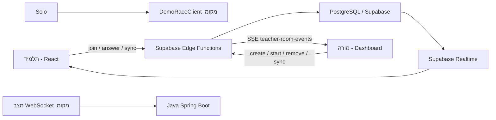

# מסמך אפיון טכני - Asphalt Math Racing

תאריך בדיקה: 15 ביוני 2026  
מקורות שנבדקו: `README.md`, `GAME_SPEC.md`, `docs/COMMUNICATION_AUDIT.md`, `docs/CLASSROOM_LOGIC_AUDIT.md`, קבצי הלקוח, קבצי השרת, Supabase Edge Functions ומיגרציות בסיס הנתונים.

## 1. הרעיון הכללי של הפרויקט

הפרויקט הוא משחק מרוץ מתמטי בדפדפן. התלמידים בוחרים רכב, נכנסים לחדר כיתה לפי קוד, ומתקדמים במרוץ דרך מענה על שאלות מתמטיקה. תשובה נכונה מוסיפה ניקוד/התקדמות ונותנת תחושת האצה במשחק; תשובה שגויה או timeout פוגעים בהתקדמות. המורה יוצר חדר, מגדיר מרוץ, רואה מי הצטרף, מתחיל את המרוץ, עוקב אחרי התלמידים בלייב ויכול להסיר תלמידים או לסיים חדר.

יש שלושה מצבי ריצה:

1. מצב כיתה בפרודקשן: Supabase Edge Functions משמשות כצד שרת מרכזי.
2. מצב WebSocket מקומי/אופציונלי: שרת Java Spring Boot עם STOMP over SockJS.
3. מצב Demo/Solo: סימולציה מקומית בדפדפן בלי שרת אמיתי.

## 2. שפות וטכנולוגיות

צד לקוח:

- TypeScript
- React 18
- Vite
- React Three Fiber / Three.js
- Zustand לניהול state
- TailwindCSS לעיצוב
- Supabase JS Client
- STOMP/SockJS למסלול WebSocket מקומי

צד שרת:

- TypeScript/Deno ב-Supabase Edge Functions
- SQL/PostgreSQL בטבלאות Supabase
- Java 21 עם Spring Boot 3 במסלול WebSocket המקומי
- Gradle לבנייה ובדיקות של שרת Java

תשתיות פריסה:

- Vercel/Firebase לפי קבצי התצורה הקיימים
- Supabase עבור פונקציות, DB ו-Realtime
- Render מוזכר ב-README כאפשרות לשרת Java

## 3. צד שרת

### 3.1 השפה

בפועל יש שני צדדי שרת:

1. שרת הפרודקשן העיקרי: Supabase Edge Functions ב-TypeScript.
2. שרת אופציונלי מקומי: Java 21 + Spring Boot.

לפי `README.md`, כאשר קיימים `VITE_SUPABASE_URL` ו-`VITE_SUPABASE_ANON_KEY`, הלקוח בוחר אוטומטית במסלול Supabase. רק אם Supabase לא מוגדר אבל `VITE_BACKEND_URL` מוגדר, הלקוח יעבוד מול שרת ה-Java WebSocket.

### 3.2 ארכיטקטורה

הארכיטקטורה הנוכחית היא היברידית:

- הלקוח שולח פעולות סמכותיות ל-Supabase Edge Functions.
- Supabase כותב את מצב המשחק לטבלת `game_rooms` בתור JSON מלא.
- טבלאות מראה כמו `classroom_rooms`, `room_participants` ו-`room_events` משמשות לרשימות חדרים, דשבורד מורה ואירועים.
- תלמיד מקבל עדכונים דרך שילוב של REST, Supabase Realtime על `game_rooms`, ו-sync fallback.
- מורה מקבל עדכונים דרך SSE בפונקציה `teacher-room-events`, עם fallback polling ל-`teacher-sync-room`.
- שרת Java המקומי מחזיק חדרים בזיכרון (`ConcurrentHashMap`) ומשדר עדכונים דרך WebSocket/STOMP.

תרשים זרימה מקוצר:

### 3.3 הבנייה

צד לקוח:

- התקנת חבילות: `cd client && npm install`
- בנייה: `npm run build`
- פיתוח: `npm run dev`

צד Java:

- בנייה/בדיקות: `cd server && ./gradlew.bat test`
- הרצה מקומית: `./gradlew.bat bootRun`
- Java מוגדר דרך Gradle toolchain לגרסה 21.

Supabase:

- הטבלאות מוגדרות תחת `supabase/migrations`.
- הפונקציות נמצאות תחת `supabase/functions`.
- פונקציות משותפות נמצאות תחת `supabase/functions/_shared`.

### 3.4 מה צד השרת עושה בדיוק

במסלול Supabase:

- יוצר חדר מורה (`teacher-create-room`).
- שומר את הגדרות החדר: שם מרוץ, כיתה, מפה, רמת קושי, ניקוד יעד, מספר משתתפים.
- מאפשר לתלמיד להצטרף (`join-game`).
- מחזיק מצב סמכותי של החדר בטבלת `game_rooms`.
- יוצר שאלות מתמטיות ומנהל את מצב השאלה לכל תלמיד.
- בודק תשובות (`submit-answer`).
- מחשב ניקוד, streak, נכון/לא נכון/timeout והתקדמות.
- מנהל מצבי חדר: lobby, starting, active, finish.
- מנהל חיבור/נוכחות דרך `game_room_presence` ו-session id.
- מסנכרן רשימות חדרים ודשבורד מורה דרך `classroom_rooms` ו-`room_participants`.
- שולח למורה אירועי live דרך `teacher-room-events`.
- מאפשר פעולות מורה: התחלה, סיום, סגירה, מחיקה, הסרת תלמיד ועדכון הגדרות.

במסלול Java:

- מחזיק חדרי משחק בזיכרון.
- מפעיל tick כל 50ms דרך `GameEngine`.
- מקבל פקודות WebSocket ב-`GameWsController`.
- מפיץ state אישי לשחקנים דרך `/user/queue/game.state`.
- מייצר שאלות דרך `QuestionGeneratorService`.
- מנהל מהירות, בוסטים, עונשים, מסלולי highway/dirt ותוצאות.
- יכול לשמור פרופיל משתמש והיסטוריית מרוץ דרך JPA/PostgreSQL אם פרופיל DB פעיל.

## 4. צד לקוח

### 4.1 המבנה

הלקוח נמצא בתיקייה `client`.

קבצים מרכזיים:

- `client/src/App.tsx`: נקודת הכניסה של האפליקציה. מחליט אם להציג התחברות, מצב תלמיד, מצב מורה, סצנת תפריט או סצנת מרוץ.
- `client/src/game/store/useGameStore.ts`: Zustand store שמחזיק את מצב המשחק.
- `client/src/game/network/transportConfig.ts`: בחירת transport: Supabase, WebSocket או Demo.
- `client/src/game/network/supabaseGame.ts`: לקוח Supabase למשחק תלמיד.
- `client/src/game/network/gameSocket.ts`: שכבת adapter כללית שמסתירה אם עובדים מול Supabase, WebSocket או Demo.
- `client/src/game/network/classroomRooms.ts`: שירות חדרי כיתה.
- `client/src/components/LobbyPanel.tsx`: מסך הצטרפות, בחירת רכב, מצב סולו ורשימת חדרים פעילים.
- `client/src/components/teacher/TeacherDashboard.tsx`: דשבורד מורה.
- `client/src/game/scene/RaceScene.tsx`: סצנת תלת-ממד של המרוץ.
- `client/src/components/QuestionOverlay.tsx`: הצגת שאלות ותשובות.
- `client/src/components/Hud.tsx` ו-`StudentClassroomHud.tsx`: נתוני מרוץ לתלמיד.
- `client/src/components/FinishOverlay.tsx`: מסך סיום.

### 4.2 הגרפיקה

הגרפיקה מבוססת Three.js דרך React Three Fiber:

- Canvas תלת-ממדי מלא מסך.
- רכבי GLB תחת `client/src/assets/3d-cars` וב-build תחת `public/assets`.
- בחירת רכבים דרך carousel/garage בתפריט.
- מסלולים שונים לפי `TrackTheme`:
  - `sunny-forest`
  - `snow-peak`
  - `fun-world`
  - `grand_prix`
- לכל מפה מוגדרים צבעי רקע, ערפל, תאורה, צבע כביש, אובייקטים סביבתיים, אפקטים ונקודות אור.
- יש Bloom, Vignette, Sparkles, תאורה דינמית וצללים.
- במצב כיתה יש עולם חוזר (`ClassroomRepeatingWorld`) כדי שהסביבה לא תיגמר כשההתקדמות מבוססת ניקוד.

### 4.3 הסידור במסכים

מסך תלמיד:

- רקע/סצנת תלת-ממד.
- כפתור הצטרפות לחדר.
- רשימת כיתות פעילות.
- כפתור משחק סולו.
- בחירת רכב ומפה.
- HUD בזמן משחק.
- שכבת שאלה מעל המרוץ.
- שכבת החלטת מסלול אם קיימת.
- מסך תוצאות בסיום.

מסך מורה:

- יצירת מרוץ חדש.
- בחירת שם מרוץ, כיתה, קושי, ניקוד יעד ומפה.
- רשימת חדרים קיימים.
- lobby עם תלמידים שהצטרפו.
- כפתור התחלת מרוץ.
- דשבורד live עם דירוג, התקדמות, תשובות נכונות/שגויות, streak ואירועים.
- פעולות ניהול: הסרת תלמיד, סיום, סגירה, מחיקה.

אימות והרשאות:

- יש מסכי login/auth.
- גישה לדשבורד מורה מוגבלת לפי `canAccessTeacher`.
- טבלאות `math_race_users` ו-`math_race_user_sessions` תומכות במשתמשים וסשנים.

## 5. איך הסנכרון עובד

### 5.1 בחירת transport

הלקוח בוחר כך:

1. אם מוגדרים `VITE_SUPABASE_URL` ו-`VITE_SUPABASE_ANON_KEY`: משתמשים ב-Supabase.
2. אחרת, אם מוגדר `VITE_BACKEND_URL`: משתמשים ב-WebSocket לשרת Java.
3. אחרת: מצב Demo מקומי.
4. חדר Solo תמיד משתמש ב-Demo.

### 5.2 סנכרון תלמיד במסלול Supabase

זרימה:

1. תלמיד בוחר חדר ושם.
2. הלקוח קורא ל-`join-game`.
3. השרת מחזיר `joined`, `stateUpdate`, ולעיתים שאלה/החלטה.
4. הלקוח נרשם ל-Supabase Realtime על טבלת `game_rooms` לפי `room_id`.
5. הלקוח מפעיל fallback sync דרך `sync-room`.
6. תשובה נשלחת ל-`submit-answer`.
7. השרת בודק תשובה ומחזיר state חדש, feedback ושאלה חדשה.
8. ה-store מעדכן UI, HUD, סצנה ושכבות שאלה.

מרווחי fallback עדכניים לפי הקוד:

- בזמן המתנה: 15 שניות.
- בזמן starting: 2 שניות.
- בזמן מרוץ פעיל: 5 שניות.
- כשהטאב מוסתר: 30 שניות.
- אם Realtime בריא, הלקוח דוחה sync עד שה-Realtime נחשב stale.

### 5.3 סנכרון מורה

זרימה:

1. המורה יוצר חדר דרך `teacher-create-room`.
2. דשבורד המורה קורא `list-teacher-rooms` כל 30 שניות לרשימת חדרים.
3. כשפותחים חדר, מתבצעת קריאה ראשונית ל-`teacher-sync-room`.
4. אחר כך נפתח SSE stream דרך `teacher-room-events`.
5. SSE שולח snapshot, events ו-heartbeats.
6. אם SSE לא מתחבר, נופל או מתיישן, מופעל fallback polling ל-`teacher-sync-room`.
7. פעולות מורה כמו start/remove/end/delete נשלחות כפונקציות REST.

### 5.4 למה יש גם Realtime וגם polling

המערכת בנויה בצורה זהירה:

- REST משמש לכתיבה סמכותית ובדיקת הרשאות.
- Realtime/SSE משמשים לעדכונים חיים.
- polling/fallback קיים כדי לא לאבד מצב במקרה ש-Realtime או SSE לא זמינים.
- זה יוצר כפילות מסוימת, אבל נותן יציבות טובה יותר.

## 6. מאיפה נשלפות השאלות

השאלות לא נשלפות מבנק שאלות סטטי בבסיס הנתונים. הן נוצרות דינמית בקוד.

במסלול Supabase:

- הקובץ המרכזי הוא `supabase/functions/_shared/questions/questionEngine.ts`.
- יש סוגי שאלות:
  - `ARITHMETIC`
  - `WORD_PROBLEM`
  - `ROUTE_CHOICE`
- יש פעולות:
  - חיבור
  - חיסור
  - כפל
  - חילוק
  - MIXED
- יש רמות:
  - EASY
  - MEDIUM
  - HARD
- יש מסלולים:
  - NORMAL
  - DIRT_ROAD
  - HIGHWAY

השאלה כוללת:

- מזהה שאלה.
- סוג שאלה.
- רמת קושי.
- פעולה מתמטית.
- prompt לתלמיד.
- תשובה נכונה.
- תשובות מתקבלות.
- אפשרויות בחירה.
- זמן לשאלה.
- ניקוד לתשובה נכונה/שגויה/timeout.
- זמני יצירה ותפוגה.

ניקוד:

- `scoringEngine.ts` מחשב `pointsDelta` ו-`progressDelta`.
- `scoringConfig.ts` מגדיר כמה נקודות מקבלים או מפסידים לפי מסלול.
- במצב כיתה, ההתקדמות היא למעשה ניקוד מול `targetScore`.

במסלול Java:

- `QuestionGeneratorService.java` מייצר שאלות לפי תבניות.
- Easy: חיבור/חיסור.
- Medium: כפל או תרגיל דו-שלבי.
- Hard: תרגילי כפל מורכבים יותר.
- גם כאן נוצרות 4 אפשרויות תשובה.

## 7. הסברים על טבלאות הנתונים

### 7.1 `user_profiles`

טבלת פרופיל בסיסית במסלול Java/legacy.

עמודות עיקריות:

- `id`: מזהה משתמש/שחקן.
- `display_name`: שם תצוגה.
- `created_at`: זמן יצירה.

### 7.2 `race_history`

שומרת היסטוריית מרוצים במסלול Java/legacy.

עמודות עיקריות:

- `id`: מזהה רשומת היסטוריה.
- `room_id`: מזהה חדר.
- `winner_player_id`: השחקן שניצח.
- `total_players`: מספר שחקנים.
- `total_laps`: מספר הקפות.
- `track_length_meters`: אורך מסלול.
- `finished_at`: זמן סיום.
- `result_payload_json`: snapshot JSON של התוצאות.

### 7.3 `game_rooms`

הטבלה המרכזית של מצב המשחק ב-Supabase.

עמודות:

- `room_id`: קוד/מזהה החדר.
- `version`: גרסת מצב.
- `state_json`: כל מצב המשחק כ-JSON.
- `updated_at`: זמן עדכון אחרון.

זו הטבלה שעליה תלמידים מקבלים Realtime update. היא מכילה את המצב הסמכותי המלא: שחקנים, שאלות פתוחות, ניקוד, מצב מרוץ, הגדרות חדר, winner ועוד.

### 7.4 `game_room_presence`

טבלת נוכחות/חיות של תלמידים.

עמודות:

- `room_id`: חדר.
- `player_id`: תלמיד.
- `session_id`: סשן דפדפן.
- `last_seen_at`: מתי נראה לאחרונה.
- `updated_at`: מתי עודכן.

המטרה: לזהות חיבור פעיל, חזרה לחדר, disconnect וניקוי session ישן.

### 7.5 `classroom_rooms`

טבלת סיכום חדרי כיתה. זו הטבלה שממנה נבנות רשימות חדרים ודשבורד מורה.

עמודות חשובות:

- `id`: UUID פנימי.
- `teacher_id`: מזהה המורה/session של המורה.
- `room_code`: קוד חדר ייחודי.
- `race_name`: שם המרוץ.
- `class_name`: שם כיתה.
- `status`: מצב חדר (`WAITING`, `RACING`, `FINISHED`, `CLOSED`, `DELETED` ועוד).
- `max_players`: מספר מקסימלי.
- `current_players`: מספר משתתפים נוכחי.
- `race_duration_sec`: משך מרוץ.
- `question_time_limit_sec`: זמן לשאלה.
- `difficulty`: רמת קושי.
- `question_type`: סוגי שאלות.
- `map_id`: מפה.
- `requires_approval`: האם צריך אישור.
- `is_locked`: האם החדר נעול.
- `is_listed`: האם החדר מופיע לתלמידים.
- `allow_mid_game_join`: האם אפשר להצטרף באמצע מרוץ.
- `target_score`: ניקוד יעד.
- זמני חיים: `created_at`, `updated_at`, `started_at`, `ended_at`, `closed_at`, `deleted_at`.

### 7.6 `room_participants`

טבלת משתתפים לכל חדר כיתה.

עמודות חשובות:

- `room_id`: מזהה חדר פנימי.
- `player_id`: מזהה תלמיד.
- `display_name`: שם תלמיד.
- `car_id` / `car_name`: רכב.
- `status`: מצב תלמיד (`JOINED`, `RACING`, `FINISHED`, `DISCONNECTED`, `KICKED` ועוד).
- `progress_percent`: אחוז התקדמות.
- `rank`: דירוג.
- `correct_answers`: תשובות נכונות.
- `wrong_answers`: תשובות שגויות.
- `timeout_answers`: תשובות שפגו בזמן.
- `score`: ניקוד.
- `streak`: רצף תשובות נכונות.
- `average_answer_time_ms`: זמן תשובה ממוצע.
- `connection_status`: מחובר/מנותק.
- `last_seen_at`: נוכחות אחרונה.
- `player_session_id`: מזהה סשן.
- זמני הצטרפות/סיום/הסרה.

### 7.7 `room_events`

טבלת אירועים לחדר.

עמודות:

- `room_id`: חדר.
- `participant_id`: משתתף, אם רלוונטי.
- `event_type`: סוג אירוע.
- `payload`: מידע נוסף ב-JSON.
- `created_at`: זמן יצירה.

משמשת לאירועים כמו הצטרפות, תשובה נכונה/שגויה, עקיפה, סיום וכדומה.

### 7.8 `race_results`

תוצאות סופיות של מרוץ כיתה.

עמודות:

- `room_id`: חדר.
- `participant_id`: תלמיד.
- `final_rank`: דירוג סופי.
- `final_progress_percent`: התקדמות סופית.
- `correct_answers`: נכונות.
- `wrong_answers`: שגויות.
- `average_answer_time_ms`: ממוצע זמן תשובה.
- `created_at`: זמן יצירת התוצאה.

### 7.9 `math_race_users`

טבלת משתמשים לאפליקציה.

עמודות:

- `id`: UUID.
- `username`: שם משתמש.
- `username_normalized`: שם משתמש מנורמל וייחודי.
- `password_hash`: hash של הסיסמה.
- `role`: תפקיד (`teacher`, `student`, `admin`).
- `created_at`, `updated_at`, `last_login_at`.

### 7.10 `math_race_user_sessions`

טבלת סשנים למשתמשים.

עמודות:

- `id`: UUID.
- `user_id`: קישור למשתמש.
- `session_token_hash`: hash של token.
- `created_at`: יצירה.
- `expires_at`: תפוגה.
- `revoked_at`: ביטול סשן.

## 8. פירוט פעולות מרכזיות

תלמיד:

- `list-active-classroom-rooms`: מביא רשימת חדרים פעילים.
- `get-classroom-room`: בודק חדר לפי קוד.
- `join-game`: מצטרף לחדר.
- `sync-room`: מסנכרן מצב וחיות.
- `submit-answer`: שולח תשובה.
- `submit-decision`: בוחר מסלול highway/dirt.
- `leave-game`: עוזב חדר.
- `return-to-lobby`: חזרה ללובי.

מורה:

- `teacher-create-room`: יצירת חדר.
- `list-teacher-rooms`: רשימת חדרי מורה.
- `teacher-sync-room`: snapshot של חדר.
- `teacher-room-events`: stream חי למורה.
- `teacher-start-race`: התחלת מרוץ.
- `teacher-update-room-settings`: עדכון הגדרות.
- `teacher-remove-player`: הסרת תלמיד.
- `teacher-end-room` / `teacher-return-to-lobby`: סיום/חזרה.
- `teacher-close-room`: סגירת חדר.
- `teacher-delete-room`: מחיקה/ארכוב חדר.
- `teacher-archive-stale-classroom-rooms`: ניקוי חדרים ישנים.

## 9. הערות חשובות מהבדיקה

- הפרויקט אינו משתמש במודל תקשורת אחד בלבד. יש REST, Realtime, SSE, polling fallback, Demo ו-WebSocket legacy.
- בפרודקשן, Supabase הוא הנתיב המרכזי.
- WebSocket Java קיים, אבל לפי המסמכים הוא בעיקר מסלול מקומי/אופציונלי ולא מכסה באופן מלא את דשבורד הכיתה החדש.
- שאלות לא נשלפות מטבלה אלא נוצרות דינמית.
- רשימת חדרים פעילים מגיעה מ-`classroom_rooms`.
- מצב המשחק המלא נשמר ב-`game_rooms.state_json`.
- במצב כיתה, המרוץ הוא score-based: התקדמות לפי ניקוד יעד, לא באמת לפי מטרים/הקפות.

## 10. נוסח לשליחה למי שצריך להשלים חלקים

אפשר לשלוח את הנוסח הבא:

שלום, עברתי על פרויקט Asphalt Math Racing והכנתי מסמך טכני שמסביר את הרעיון הכללי, השפות, צד השרת, צד הלקוח, הסנכרון, מקור השאלות וטבלאות הנתונים.

אשמח שתעבור על החלקים שרלוונטיים אליך ותוסיף פירוט מדויק במקומות שבהם אתה אחראי:

- אם אתה אחראי צד שרת: נא לפרט את הארכיטקטורה, הפונקציות, מנגנון הרשאות, איך מתבצע persistence, ומה הנתיב הרשמי לפרודקשן.
- אם אתה אחראי צד לקוח: נא לפרט את מבנה המסכים, רכיבי UI מרכזיים, ניהול state, בחירת transport, והסידור הגרפי.
- אם אתה אחראי DB/Supabase: נא לפרט את תפקיד כל טבלה, אילו טבלאות הן מקור אמת ואילו הן טבלאות מראה, ומה מדיניות RLS/Realtime.
- אם אתה אחראי Gameplay/Questions: נא לפרט איך נקבעות רמות הקושי, סוגי השאלות, ניקוד, מסלולי highway/dirt ו-target score.
- אם יש שינוי בין הקוד הקיים לבין מה שמתוכנן לפרודקשן, נא לציין זאת במפורש.

חשוב במיוחד לאשר:

1. האם Supabase הוא הנתיב הרשמי בפרודקשן.
2. האם שרת Java נשאר רק להרצה מקומית/legacy.
3. האם שאלות אמורות להישאר דינמיות או שבהמשך יהיה בנק שאלות.
4. האם חדרים במצב RACING אמורים להופיע לתלמידים אם `allow_mid_game_join` פעיל.
5. האם `race_results` כבר בשימוש מלא או מיועד לשלב עתידי.

